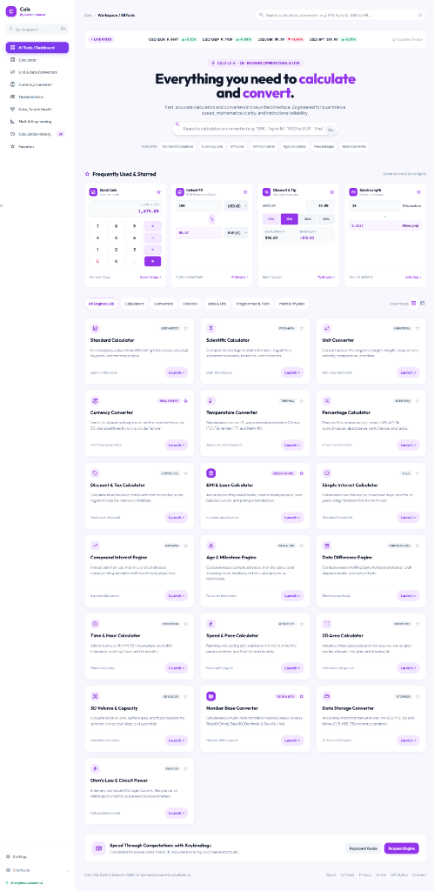

# 🧮 Calx — Universal Engine & Calculation Suite

> **Created by Sachin Jatavat**

Calx is a state-of-the-art, responsive, light purple-themed universal calculation suite. Engineered for speed, mathematical clarity, and touch-friendly mobile usability, Calx combines 28+ calculation engines—ranging from scientific math and 24/7 live forex currency conversions to financial loan tools, unit converters, and base number systems—in a single unified inline workspace.

---

## 🖼️ Application Previews

<div align="center">
  <h3>Desktop Dashboard Workspace</h3>
  
</div>

---

## ✨ Key Features

- 📱 **Inline View Workspace (Zero Popups)**: Seamlessly switch between all calculation tools directly within the page container without blocking modal overlays or needing to press `ESC` or `X`.
- 💱 **24/7 Live Currency Converter**: Real-time exchange rate updates powered by a secure server-side API proxy with automatic failover fallback (`Open ER-API` & `ExchangeRate-API`).
- 🧮 **Standard & Scientific Calculator**: Complete support for trigonometry (`sin`, `cos`, `tan`), logarithms (`log`, `ln`), square roots, exponents, constants (`π`, `e`), and memory registers (`MC`, `MR`, `M+`, `M-`).
- 💰 **Financial Tools Suite**: Interactive engines for Loan EMI calculations, Compound Interest maturity, ROI / CAGR returns, GST & Tax calculation, and Tip splitting.
- 📐 **Multi-Unit & Data Converters**: Instant conversions across Length, Weight, Volume, Temperature, Speed, Data Storage, and Area.
- ⚡ **Math & Engineering Workbench**: Number radix base conversion (Decimal, Hexadecimal, Binary, Octal) and Ohm's Law electrical power calculator.
- 🩺 **Date, Time & Health Utilities**: Exact age milestone calculation and BMI health diagnostic gauge.
- 🎨 **Purple Pastel Light Design**: High-contrast, clean light containers (`bg-purple-50/70 border border-purple-200`) with bold black numerical output text (`text-slate-900 font-extrabold`).
- 📲 **Fully Responsive & Mobile Drawer**: Drawer navigation menu, fluid typography, and custom horizontal tab bars for mobile users.

---

## 📂 Project Structure

```text
Calx/
├── index.html            # Main HTML5 Single-Page Application & Layout
├── app.js                # Core Application Logic, Calculations & View Router
├── styles.css            # Custom CSS Tokens, Animations & Micro-Interactions
├── server.js             # Zero-Dependency Node.js Server & FX Rates API Proxy
├── package.json          # Node.js Project Configuration & NPM Scripts
├── assets/               # Image & Screenshot Assets
│   ├── dashboard-preview.jpg
│   └── mobile-preview.jpg
├── .env.example          # Sample Environment Variables
├── .env                  # Private Secrets & Server Config (Git Ignored)
└── .gitignore            # Git Rule Configuration
```

---

## 🚀 Quick Start

### 1. Prerequisites
- **Node.js** (v14.0.0 or higher recommended)

### 2. Installation
Clone the repository and enter the directory:
```bash
git clone https://github.com/sachinjatavat/CalcX-Calculator.git
cd CalcX-Calculator
```

### 3. Setup Environment
Copy `.env.example` to `.env`:
```bash
cp .env.example .env
```
*(Optional)* Add your free `ExchangeRate-API` key into `.env` for custom rate limits:
```env
PORT=3000
EXCHANGE_RATE_API_KEY=your_actual_api_key_here
```

### 4. Run Locally
Start the server:
```bash
npm start
```
Open your browser and navigate to:
```text
http://localhost:3000
```

---

## 🌐 Cloud Deployment

Calx is zero-dependency and ready for 1-click cloud deployment:

- **Render / Railway**: Connect repo -> Build Command: *(leave empty)* -> Start Command: `npm start`. Add `EXCHANGE_RATE_API_KEY` under Environment Variables.
- **Vercel / Heroku**: Use `node server.js` as the application entry point.

---

## 📄 Developer & License

Designed and engineered with ❤️ by **Sachin Jatavat**.
Distributed under the MIT License.
